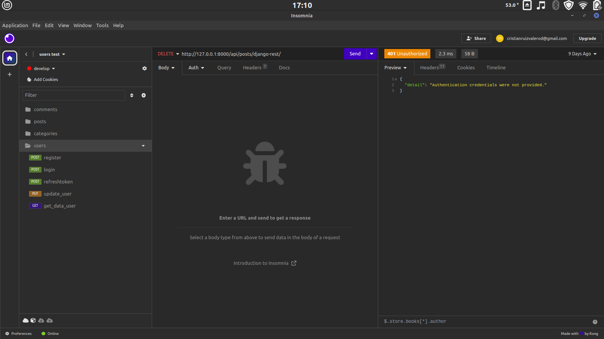
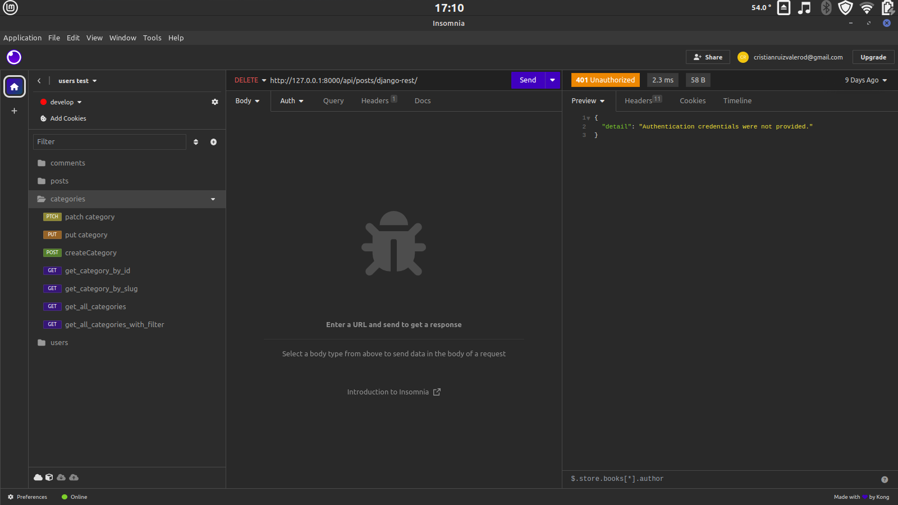
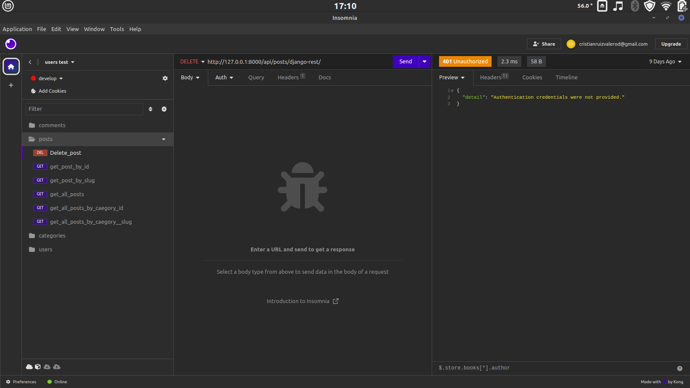
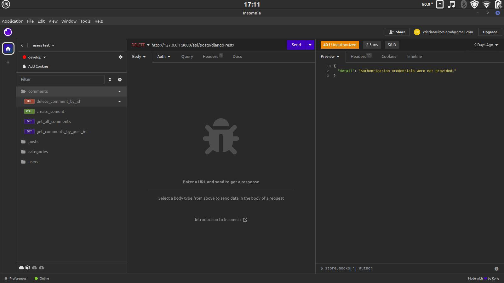

# Api blog V1.0
api creada en linux mint con pycharm 

## Instalación:
- python -m venv env

Activación en Unix
- source env/bin/activate

Activación en Windows
- env\Scripts\activate

## Instalacion requerimientos
- pip install -r requirements.txt

## Configuraciones
- crear un archivo .env en la raiz donde se encuentra el archivo settings

- el archivo .env debe contener lo que tiene detalle.md

- crear una base de datos en mysql llamada tf_blog

## Inicio 
- make migrate
- make runserver
- Para crear un super usuario y acceder al admin:

- make createsuperuser

## Test
- descargar el archivo insomnia_test.json (se encuentra dentro del directoriotest/insomnia)
- importa el archivo dentro de insomnia en el directorio test

